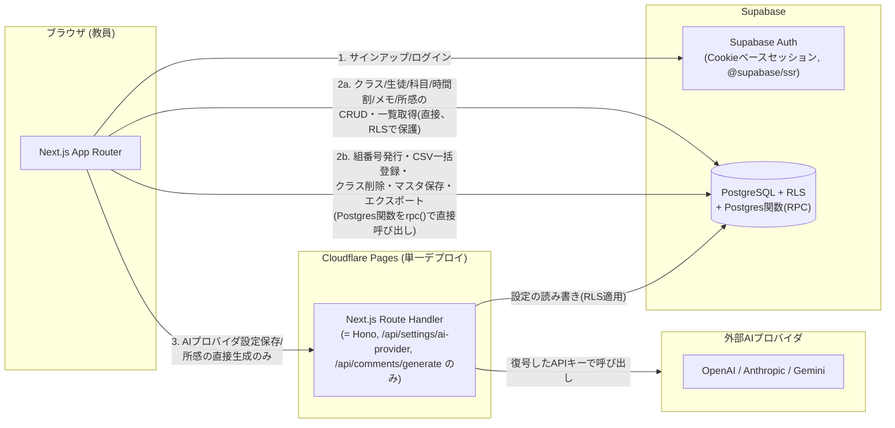

# 技術設計書:週間時間割・生徒メモ・所感自動生成ツール

`docs/requirements.md`(要件定義書)と`docs/data-model.md`(データモデル案)をもとにした技術設計書。データモデルはdata-model.mdの内容を正とし、本書ではそれをDDLレベルまで具体化する。要件が実装方式を明示していない箇所は、非機能要件(RLSによるテナント分離、Cloudflare/Supabase無料プラン運用、JST固定等)から逆算して選定し、理由を明記する。

本書は初版に対するシニアレビューを受け、以下の4点をユーザーに再ヒアリングした上での改訂版である。

## 0. 再ヒアリングで確定した意思決定

| 論点 | 決定 | 反映箇所 |
|---|---|---|
| API層の範囲 | 全CRUDをAPI経由にする案は不採用。**秘密情報(暗号化鍵・外部AIプロバイダの生APIキー)に触れる操作だけをHono経由にし、それ以外は全てブラウザから直接Supabaseへアクセスする**(RLSで保護) | §1, §5 |
| 想定規模 | 個人〜身内数人のまま固定。**モノレポ構成・重量級のテスト基盤投資はしない** | §2, §3, §7 |
| Supabase無料プランの自動一時停止 | リスクを許容し、対策コード(定期ping等)は実装しない | §8 |
| 科目名の重複可否 | **重複を許可する**。`(teacher_id, name)`のDBユニーク制約は設けない | §4 |

これに伴い、初版レビューで指摘された以下の問題も併せて解消している(詳細は各節で個別に言及):

- CSV一括登録が「一部行だけ保存される」仕様(F2)と、エラーハンドリング方針の「部分保存を作らない」原則が矛盾していた点 → 原則の適用範囲を明確化(§6)
- 複数テーブルにまたがる操作がPostgREST経由の複数回呼び出しになりトランザクション保証がなかった点 → Postgres関数(RPC)に集約し、単一トランザクションで実行(§4, §5)
- Next.js Middlewareでの未ログインガードが、ブラウザ管理のセッション(localStorage/sessionStorage相当)とかみ合っていなかった点 → Cookieベースセッション(`@supabase/ssr`)に変更し実際に機能する形にした(§1)
- `teacher_profile`行の作成契機が未定義だった点 → `auth.users`へのINSERTトリガーで自動作成するよう明記(§4)
- data-model.mdの`TEACHER.email`とdesign.mdの`teacher_profile`テーブルの不整合 → `email`は`auth.users`側にのみ持たせ、アプリ側テーブルには複製しないと明記(§4)
- APIキー暗号化のIV・AAD(コンテキストバインディング)が未定義だった点 → 実装方針を明記(§4)
- CORS方針が未定義だった点 → Honoを別Workersではなく同一Next.jsアプリ内にマウントする構成にしたことで、そもそもクロスオリジンにならず問題自体が消滅(§1)

## 1. アーキテクチャ概要

**Next.js単体アプリケーション**として構成する。Honoは別デプロイのCloudflare Workersではなく、Next.js App RouterのRoute Handler(`app/api/[[...route]]/route.ts`)内にマウントする。Pages Functionsの実行基盤自体がCloudflare Workers runtimeであるため、要件が指定する「Cloudflare Pages/Workersを用いる」は満たしたまま、デプロイ単位を1つに減らせる。

原則は次の1文に集約される:**秘密情報に触れる操作だけがHonoを経由し、それ以外の全CRUDはブラウザから`supabase-js`で直接Supabaseへアクセスする。**



設計上のポイント:

- **認証はSupabase Authに委譲し、Cookieベースセッションを使う。** `@supabase/ssr`を用いてセッションをCookieに保持することで、Next.jsのServer ComponentsやEdge Middleware(`middleware.ts`)からもログイン状態を判定できる。初版ではブラウザのみが把握するセッション(localStorage相当)を前提にmiddlewareでガードする設計になっており、Edge側からlocalStorageは読めないため実際にはガードが機能しない矛盾があった。Cookieベースにすることでこの矛盾を解消し、F8(未ログイン時のリダイレクト)を実際にサーバー側で保証する。
- **単純CRUDはHonoを経由しない。** クラス・生徒・科目・時間割・メモ・所感の読み書きは、ブラウザの`supabase-js`クライアントがユーザーのセッション(JWT)を使って直接PostgRESTへアクセスする。RLSポリシーがテナント分離の最終防衛線であり、かつ唯一の防衛線になる(アプリ層のフィルタ漏れという回避不能な依存を作らない)。
- **複数テーブルにまたがる操作はPostgres関数(RPC)に集約する。** 組番号の発行とクラス作成、クラス削除に伴う時間割参照のクリーンアップ、CSV一括登録、時間割マスタ保存時の週次個別変更の巻き戻し判定、データエクスポートは、いずれも複数行・複数テーブルを一貫性を保ったまま更新する必要がある。これらをHonoハンドラ内での複数回のAPI呼び出しとして実装すると、途中で失敗した場合に部分的な更新が残ってしまう(初版の問題点)。Postgres関数として実装すれば、1回の呼び出しが1つのDBトランザクションになり、この問題が構造的に起きない。Postgres関数はデフォルトで`SECURITY INVOKER`(呼び出し元の権限で実行)であるため、Honoを経由しなくてもRLSはそのまま効く。したがってこれらもブラウザから`supabase.rpc()`で直接呼び出せる。
- **Honoが担当するのは、秘密情報が絡む処理だけに絞る。** 具体的には(a)AIプロバイダのAPIキーをサーバー側で暗号化して保存する処理、(b)保存済みのAPIキーを復号して外部AIプロバイダを呼び出す処理、の2系統のみ。暗号化鍵(Workers Secrets)はPostgres側には一切置かず、DBが仮に全件漏洩してもこの鍵だけは漏れない、という多層防御を維持するため、この2つだけは今後もHono(Workers runtime)側に残す。
- **同一オリジンになるためCORS設定が不要になる。** 初版はフロント(Cloudflare Pages)とAPI(別のCloudflare Workers)が別オリジンになる想定で、CORS方針が未定義のまま残っていた。Honoを同一Next.jsアプリ内にマウントする本構成では、そもそもクロスオリジンリクエストが発生しないためこの問題は解消される。
- **最低限のCSPヘッダーを設定する。** メモ・所感の本文は自由記述のテキストで、Reactの自動エスケープによりXSSは基本的に防がれるが、`default-src 'self'`を基本としたCSPヘッダーをNext.jsのレスポンスに付与し、多層防御としておく(将来Markdownレンダリングや`dangerouslySetInnerHTML`を追加する際の保険にもなる)。

## 2. 技術スタック(選定理由付き)

| 領域 | 採用技術 | 選定理由 |
|---|---|---|
| フロントエンド | Next.js (App Router) + TypeScript | 要件定義書で指定。認証必須のCRUD画面が中心でSEO要件がないため、ほぼ全画面をクライアントコンポーネントとして実装し、SSR/RSCには依存しない。ファイルベースルーティングでF1〜F14の画面数に素直に対応させる |
| バックエンド(最小構成) | Hono + TypeScript(Next.jsのRoute Handlerとしてマウント) | 要件定義書で「バックエンドはHono」と指定されているため、独立したフレームワークとして残すが、担当範囲は§1の通り最小化した。`app.fetch`がWeb標準のFetch API形状(Request→Response)に一致するため、Next.jsのRoute HandlerのGET/POST/PUTハンドラにそのまま割り当てられる |
| ホスティング | Cloudflare Pages(Next.js本体+Hono両方を含む単一デプロイ) | 要件定義書で指定。初版は「フロント用Pages」「API用Workers」の2デプロイだったが、Honoの担当範囲縮小により1デプロイに統合し、運用対象を減らした |
| DB・認証 | Supabase (PostgreSQL + Supabase Auth + RLS) | 要件定義書で指定 |
| DBアクセス方式 | `@supabase/supabase-js`(PostgREST経由、ブラウザから直接) + **Postgres関数(RPC)** | 単純CRUDはPostgRESTへの直接アクセス、複数テーブルにまたがる操作やビジネスロジックはPostgres関数に寄せる。これによりHonoというアプリケーション層を経由せずに「RLSで保護されたアトミックな操作」が実現でき、初版で懸念だった非アトミック性とAPI層の肥大化を同時に解消する。代償として、ビジネスロジックの一部がTypeScriptではなくPL/pgSQLで書かれることになり、DB側のロジックのテスト・デバッグには別スキルセットが要る(§7で許容コストとして明記) |
| 認証セッション管理 | `@supabase/ssr`(Cookieベース) | Next.jsのMiddleware・Server Componentからもログイン状態を判定できる必要があるため。ブラウザのみが保持するセッションでは§1で述べた矛盾が生じる |
| 状態管理(サーバー state) | TanStack Query | `supabase-js`の直接呼び出し結果をクラス切替・週次時間割の期間ジャンプ等の画面間でキャッシュ・再検証するために利用。保存はLWW(最後の保存が勝つ)方針のため楽観的更新は行わず(§6)、キャッシュ管理の目的に限定して使う |
| フォーム・バリデーション | react-hook-form + zod | `packages/`ではなく単一アプリ内の`shared/schemas`にzodスキーマを置き、フロントのバリデーション(`zodResolver`)とRPC呼び出し前のクライアント側事前チェックの両方で使い回す。DB側の制約(NOT NULL、CHECK、RLS)が最終防衛線であることに変わりはない |
| 日付・週番号計算 | date-fns + date-fns-tz | 非機能要件で日付計算を常にJST固定と定めているため、サーバー実行環境のTZに依存しないライブラリが必要 |
| AIプロバイダ呼び出し | 各プロバイダ公式REST APIへの`fetch`直呼び出し(共通アダプタ層でラップ、Hono側のみ) | ストリーミング等の高度機能は不要で、「プロンプトを送って完成文を1回受け取る」だけの単純な呼び出しのため、SDK依存を増やさない。3社分のリクエスト/レスポンス形式・エラー形式の変更に自前で追従するコストは継続的に発生する点は許容する |
| APIキー暗号化 | Web Crypto API (`crypto.subtle`, AES-256-GCM、IVは`crypto.getRandomValues`で暗号化ごとに12byte生成、AADに`teacher_id`を付与) | Workers runtime標準のWeb Crypto APIのみで完結。AADに`teacher_id`を付与することで、万一暗号文が別の行にコピーされても(DBバグ・SQLインジェクション等)本来の所有者以外では復号時の認証タグ検証が失敗し復号できない、というコンテキストバインディングを持たせた(初版で欠けていた対策) |
| プロジェクト構成 | **単一Next.jsアプリ(モノレポ・pnpm workspacesは廃止)** | 初版はapps/web・apps/api・packages/sharedの3分割モノレポだったが、Honoの担当範囲が3エンドポイントまで縮小したため、独立デプロイを分ける理由がなくなった。想定規模(個人〜身内数人)に対してモノレポ管理コストは見合わないという再ヒアリングの結論を反映し、単一アプリ内のディレクトリ分割(`shared/`)で十分とした |
| 単体・結合テスト | Vitest + React Testing Library | 変更なし |
| E2Eテスト | Playwright(スコープを縮小、§7参照) | 変更なし。ただし網羅範囲は絞る |

## 3. ディレクトリ構成

```
.
├── app/
│   ├── (auth)/
│   │   ├── login/page.tsx
│   │   ├── signup/page.tsx
│   │   └── reset-password/page.tsx
│   ├── (main)/                     # ログイン必須。middleware.tsでガード(F8)
│   │   ├── layout.tsx              # ヘッダー・クラス切替(F1)
│   │   ├── classes/page.tsx
│   │   ├── students/page.tsx
│   │   ├── subjects/page.tsx
│   │   ├── timetable/
│   │   │   ├── master/page.tsx
│   │   │   └── weekly/page.tsx
│   │   ├── memos/
│   │   │   ├── record/page.tsx         # 授業記録(F6)
│   │   │   └── students/[id]/page.tsx  # 生徒別メモ一覧(F7)
│   │   ├── comments/
│   │   │   └── students/[id]/page.tsx  # 所感生成・履歴(F9-F11)
│   │   └── settings/
│   │       ├── ai-provider/page.tsx
│   │       ├── prompt-template/page.tsx
│   │       └── export/page.tsx
│   ├── api/
│   │   └── [[...route]]/route.ts   # Honoアプリのマウント先(§5.1)
│   └── middleware.ts               # 未ログイン時のリダイレクト(@supabase/ssr, F8)
├── components/
│   ├── timetable/                  # WeeklyTimetableGrid, SlotEditModal 等
│   ├── memo/
│   ├── comment/
│   └── ui/                         # 確認ダイアログ等の汎用コンポーネント
├── hooks/                          # useClasses, useWeeklyTimetable 等(TanStack Query)
├── lib/
│   ├── supabase-browser.ts         # supabase-jsクライアント(直接CRUD・RPC呼び出し兼用)
│   ├── supabase-server.ts          # middleware/Server Component用(@supabase/ssr)
│   └── hono-server/                # Honoアプリ本体
│       ├── app.ts
│       ├── routes/
│       │   └── ai.ts               # /settings/ai-provider, /comments/generate
│       └── services/
│           ├── ai-adapters/        # openai.ts, anthropic.ts, gemini.ts
│           └── crypto.ts           # APIキー暗号化/復号
├── shared/
│   ├── schemas/                    # zodスキーマ
│   ├── pseudonym.ts                # 仮名コード生成(純粋関数)
│   ├── week.ts                     # JST週番号計算(純粋関数)
│   ├── prompt-builder.ts           # プロンプト組み立て(純粋関数)
│   └── resolve-weekly-slots.ts     # マスタ+個別変更の解決(純粋関数、§5.4)
├── db/
│   └── migrations/                 # Supabase CLIのSQLマイグレーション(テーブル+RPC関数)
└── docs/
    ├── requirements.md
    ├── data-model.md
    └── design.md
```

`shared/`を独立パッケージ化(モノレポ)しない理由:Honoも同一Next.jsアプリ内で動くため、TypeScriptのpathエイリアス(`@/shared/...`)だけで参照でき、別パッケージとして切り出すメリット(独立バージョニング、別リポジトリからの再利用)が現時点では発生しない。将来的に複数教員以外の利用形態(モバイルアプリ等)が生まれた場合に、初めて切り出しを検討すればよい。

## 4. データモデル(詳細)

### 4.1 共通方針(変更なし)

- 全テーブルにRLSを有効化し、ポリシーは例外なく`auth.uid()`との比較で書く。
- サービスロールキーはマイグレーション適用等の管理operationでのみ使用し、アプリケーションランタイム(Hono・Postgres関数とも)からは使用しない。Postgres関数は`SECURITY INVOKER`(デフォルト)のまま実装し、`SECURITY DEFINER`は使わない(RLSを迂回させないため)。
- `id`は全テーブル`uuid default gen_random_uuid()`。タイムスタンプは`timestamptz`でUTC一貫、JST変換は`shared/week.ts`側で行う。

### 4.2 テーブル定義

```sql
-- 教員プロフィール。auth.users を拡張する形で持つ。
-- email は auth.users 側にのみ存在し、こちらには複製しない
-- (二重管理によるズレを避けるため。UI表示が必要な場合はセッションから取得する)
create table teacher_profile (
  id uuid primary key references auth.users(id) on delete cascade,
  start_date date,                 -- 起算日。未設定はnull
  created_at timestamptz not null default now()
);

-- auth.users への新規登録時に teacher_profile を自動作成するトリガー
-- (F8「サインアップ直後から利用できる」を満たすために必須。初版で欠落していた)
create function handle_new_teacher() returns trigger
language plpgsql security definer set search_path = public as $$
begin
  insert into public.teacher_profile (id) values (new.id);
  return new;
end;
$$;

create trigger on_auth_user_created
  after insert on auth.users
  for each row execute function handle_new_teacher();

create table class_number_counter (
  id uuid primary key default gen_random_uuid(),
  teacher_id uuid not null references teacher_profile(id) on delete cascade,
  grade_group text not null,       -- 通常学年の値、または '特支'
  last_issued_number int not null default 0,
  unique (teacher_id, grade_group)
);

create table class (
  id uuid primary key default gen_random_uuid(),
  teacher_id uuid not null references teacher_profile(id) on delete cascade,
  grade text not null,
  group_number int not null,
  display_name text not null,
  created_at timestamptz not null default now(),
  unique (teacher_id, grade, group_number)
);

create table student (
  id uuid primary key default gen_random_uuid(),
  class_id uuid not null references class(id) on delete cascade,
  attendance_number int not null,
  name text not null,
  created_at timestamptz not null default now(),
  unique (class_id, attendance_number)
);

-- 科目名の重複は許可する(再ヒアリングでの決定)。ユニーク制約は設けない
create table subject (
  id uuid primary key default gen_random_uuid(),
  teacher_id uuid not null references teacher_profile(id) on delete cascade,
  name text not null,
  created_at timestamptz not null default now()
);

create table timetable_master_slot (
  id uuid primary key default gen_random_uuid(),
  teacher_id uuid not null references teacher_profile(id) on delete cascade,
  weekday int not null check (weekday between 1 and 5),
  period int not null check (period between 1 and 6),
  subject_id uuid references subject(id) on delete set null,
  class_id uuid references class(id) on delete set null,
  unique (teacher_id, weekday, period)
);

create table weekly_subject_override (
  id uuid primary key default gen_random_uuid(),
  teacher_id uuid not null references teacher_profile(id) on delete cascade,
  week_start_date date not null,
  weekday int not null check (weekday between 1 and 5),
  period int not null check (period between 1 and 6),
  subject_id uuid references subject(id) on delete set null, -- null = 未設定(空きコマ)
  unique (teacher_id, week_start_date, weekday, period)
);

create table weekly_class_override (
  id uuid primary key default gen_random_uuid(),
  teacher_id uuid not null references teacher_profile(id) on delete cascade,
  week_start_date date not null,
  weekday int not null check (weekday between 1 and 5),
  period int not null check (period between 1 and 6),
  class_id uuid not null references class(id) on delete cascade,
  unique (teacher_id, week_start_date, weekday, period)
);

create type share_flag as enum ('shared', 'private');

create table memo (
  id uuid primary key default gen_random_uuid(),
  student_id uuid not null references student(id) on delete cascade,
  subject_id uuid not null references subject(id) on delete restrict,
  note_date date not null,
  period int not null check (period between 1 and 6),
  content text not null,
  share_flag share_flag not null default 'shared',
  created_at timestamptz not null default now(),
  updated_at timestamptz not null default now(),
  unique (student_id, subject_id, note_date, period)
);

create type comment_creation_method as enum ('direct_ai', 'prompt_copy', 'manual');

create table student_comment (
  id uuid primary key default gen_random_uuid(),
  student_id uuid not null references student(id) on delete cascade,
  period_start_date date not null,
  period_end_date date not null,
  content text not null,
  target_char_count int,
  creation_method comment_creation_method not null,
  created_at timestamptz not null default now(),
  updated_at timestamptz not null default now(),
  unique (student_id, period_start_date, period_end_date)
);

create type ai_provider as enum ('openai', 'anthropic', 'gemini');

create table ai_provider_setting (
  id uuid primary key default gen_random_uuid(),
  teacher_id uuid not null unique references teacher_profile(id) on delete cascade,
  provider ai_provider not null,
  model text not null,
  encrypted_api_key text not null, -- base64(iv(12byte) || ciphertext || authTag), AES-256-GCM, AAD=teacher_id
  updated_at timestamptz not null default now()
);

create table prompt_template (
  id uuid primary key default gen_random_uuid(),
  teacher_id uuid not null unique references teacher_profile(id) on delete cascade,
  content text not null,
  updated_at timestamptz not null default now()
);
```

`subject`の削除制限(F3:メモで使用中は削除不可)は`memo.subject_id on delete restrict`で保証する。`timetable_master_slot`/`weekly_subject_override`側は`on delete set null`とし、「時間割でのみ使用中」の場合は削除自体は成功させ未設定に戻す(要件通り)。「メモで使用中」の場合だけを事前チェックしエラーメッセージを出すロジックは、後述の`delete_subject`関数に集約する。

### 4.3 RLSポリシー(変更なし、方針のみ再掲)

```sql
alter table class enable row level security;

create policy "teacher can manage own classes"
  on class for all
  using (teacher_id = auth.uid())
  with check (teacher_id = auth.uid());
```

`student`/`memo`/`student_comment`のように`teacher_id`を直接持たないテーブルは、親テーブル経由のサブクエリでポリシーを書く(初版と同じ)。

### 4.4 Postgres関数(RPC) ― アトミック性が必要な操作の集約先

初版では「クラス削除時のoverride削除→スロットnull化→クラス削除」のような複数テーブル操作をHonoハンドラ内で複数回のAPI呼び出しとして実装する想定だったが、これは失敗時に部分更新が残るリスクがあった。以下は全てブラウザから`supabase.rpc('関数名', {...})`で直接呼び出し、`auth.uid()`を関数内部で使うことで、渡されたパラメータの偽装(他教員のteacher_idを渡す等)がRLS・関数内チェックの両方で防がれるようにする。

```sql
-- クラス作成: 組番号発行+クラス作成を1トランザクションで
create function create_class(p_grade text, p_display_name text)
returns class
language plpgsql
as $$
declare
  v_teacher_id uuid := auth.uid();
  v_group_number int;
  v_class class;
begin
  insert into class_number_counter (teacher_id, grade_group, last_issued_number)
  values (v_teacher_id, p_grade, 1)
  on conflict (teacher_id, grade_group)
  do update set last_issued_number = class_number_counter.last_issued_number + 1
  returning last_issued_number into v_group_number;

  insert into class (teacher_id, grade, group_number, display_name)
  values (v_teacher_id, p_grade, v_group_number, p_display_name)
  returning * into v_class;

  return v_class;
end;
$$;

-- クラスの学年変更: 新学年区分内で未使用の組番号に再採番
create function update_class_grade(p_class_id uuid, p_new_grade text)
returns class
language plpgsql
as $$
declare
  v_teacher_id uuid := auth.uid();
  v_group_number int;
  v_class class;
begin
  insert into class_number_counter (teacher_id, grade_group, last_issued_number)
  values (v_teacher_id, p_new_grade, 1)
  on conflict (teacher_id, grade_group)
  do update set last_issued_number = class_number_counter.last_issued_number + 1
  returning last_issued_number into v_group_number;

  update class
  set grade = p_new_grade, group_number = v_group_number
  where id = p_class_id and teacher_id = v_teacher_id
  returning * into v_class;

  if v_class is null then
    raise exception 'NOT_FOUND: クラスが見つかりません';
  end if;

  return v_class;
end;
$$;

-- クラス削除: 生徒0人チェック→時間割参照のクリーンアップ→削除、を1トランザクションで
create function delete_class(p_class_id uuid)
returns void
language plpgsql
as $$
declare
  v_teacher_id uuid := auth.uid();
  v_student_count int;
begin
  select count(*) into v_student_count from student where class_id = p_class_id;
  if v_student_count > 0 then
    raise exception 'STUDENTS_EXIST: 生徒が登録されているため削除できません。先に生徒名簿から生徒を削除してください';
  end if;

  update timetable_master_slot set class_id = null
    where class_id = p_class_id and teacher_id = v_teacher_id;
  delete from weekly_class_override
    where class_id = p_class_id and teacher_id = v_teacher_id;
  delete from class
    where id = p_class_id and teacher_id = v_teacher_id;
end;
$$;

-- 科目削除: メモで使用中なら拒否、時間割のみ使用中ならset nullされた上で削除
create function delete_subject(p_subject_id uuid)
returns void
language plpgsql
as $$
declare
  v_teacher_id uuid := auth.uid();
  v_memo_count int;
begin
  select count(*) into v_memo_count
  from memo m join student s on s.id = m.student_id join class c on c.id = s.class_id
  where m.subject_id = p_subject_id and c.teacher_id = v_teacher_id;

  if v_memo_count > 0 then
    raise exception 'SUBJECT_IN_USE: この科目は時間割またはメモで使用されているため削除できません';
  end if;

  delete from subject where id = p_subject_id and teacher_id = v_teacher_id;
  -- timetable_master_slot / weekly_subject_override の subject_id は on delete set null で自動的に未設定へ
end;
$$;

-- CSV一括登録: 行ごとの部分成功を返す(F2の仕様通り、全体をロールバックしない)
create function import_students(p_class_id uuid, p_rows jsonb)
returns jsonb
language plpgsql
as $$
declare
  v_teacher_id uuid := auth.uid();
  v_row jsonb;
  v_errors jsonb := '[]'::jsonb;
  v_imported jsonb := '[]'::jsonb;
  v_seen int[] := '{}';
begin
  -- p_class_id が呼び出し教員のものであることを確認
  perform 1 from class where id = p_class_id and teacher_id = v_teacher_id;
  if not found then
    raise exception 'NOT_FOUND: クラスが見つかりません';
  end if;

  for v_row in select * from jsonb_array_elements(p_rows) loop
    -- 氏名・出席番号の必須チェック、バッチ内重複チェック、DB内既存重複チェックを行い、
    -- 有効な行だけ insert into student、無効な行は理由付きで v_errors に積む
    -- (詳細なバリデーション手順は実装時にPL/pgSQLで展開する)
    null;
  end loop;

  return jsonb_build_object('imported', v_imported, 'errors', v_errors);
end;
$$;

-- 時間割マスタ保存: 全スロット upsert + 既存の週次個別変更のうち
-- 新しいマスタ内容と一致した項目だけをマスタ追従に戻す(F4の巻き戻しロジック)
create function save_timetable_master(p_slots jsonb, p_confirm_overwrite boolean default false)
returns jsonb
language plpgsql
as $$
declare
  v_teacher_id uuid := auth.uid();
begin
  -- 1. p_slots の内容で timetable_master_slot を upsert
  -- 2. 保存後のマスタ内容と一致する weekly_subject_override / weekly_class_override 行を削除
  --    (一致 = マスタ追従への巻き戻し。部分一致(科目のみ/クラスのみ)はそれぞれのテーブル単位で判定できるため、
  --     テーブルを分離した初版のデータモデルがそのままこのロジックを素直に表現する)
  -- 3. 一括モードでの上書きにより既存の個別クラス設定が失われる場合は、
  --    p_confirm_overwrite=false ならここで例外を投げてフロントに確認ダイアログを出させる
  return jsonb_build_object('ok', true);
end;
$$;

-- 起算日の変更: 通常保存(メモが1件でもあれば拒否) と 年度更新(強制)を1関数に集約
create function update_timetable_start_date(p_new_start_date date, p_force boolean default false)
returns teacher_profile
language plpgsql
as $$
declare
  v_teacher_id uuid := auth.uid();
  v_memo_count int;
  v_profile teacher_profile;
begin
  if not p_force then
    select count(*) into v_memo_count
    from memo m join student s on s.id = m.student_id join class c on c.id = s.class_id
    where c.teacher_id = v_teacher_id;

    if v_memo_count > 0 then
      raise exception 'START_DATE_LOCKED: 授業記録が開始されているため起算日は変更できません';
    end if;
  end if;

  update teacher_profile set start_date = p_new_start_date
    where id = v_teacher_id
    returning * into v_profile;

  return v_profile;
end;
$$;

-- 全データエクスポート: 生徒ごとにメモ・所感がまとまったJSONを1回で返す
create function export_teacher_data()
returns jsonb
language plpgsql
as $$
declare
  v_teacher_id uuid := auth.uid();
begin
  -- classes / subjects / timetable_master_slot / weekly_*_override /
  -- (student × memos × comments をネストしたJSON) をまとめて1つのjsonbで返す。
  -- ai_provider_setting は対象外(F14)
  return '{}'::jsonb;
end;
$$;
```

`import_students`と`save_timetable_master`は完全なPL/pgSQL実装をここでは省略している(設計書としてはインターフェースとトランザクション境界を示すことを目的とし、詳細なループ処理は実装時に展開する)。

### 4.5 仮名コードは保存しない(変更なし)

`class.grade` + `class.group_number` + `student.attendance_number`からリクエスト時に都度計算する派生値。DBにカラムは持たない。

## 5. 主要なAPI/関数/コンポーネントのインターフェース

### 5.1 Hono(最小構成)

`app/api/[[...route]]/route.ts`にマウントする。担当するのは秘密情報が絡む2系統・3エンドポイントのみ。

```ts
import { Hono } from "hono";

export const runtime = "edge";

const app = new Hono().basePath("/api");

app.get("/settings/ai-provider", /* ... */);   // 現在の provider/model と hasKey(boolean) のみ返す。鍵本体は返さない
app.put("/settings/ai-provider", /* ... */);   // { provider, model, apiKey } を受け取り、暗号化して保存
app.post("/comments/generate", /* ... */);     // { prompt, targetCharCount? } を受け取り、外部AIへ送信し { rawText } を返す

export const GET = app.fetch;
export const PUT = app.fetch;
export const POST = app.fetch;
```

**認証方式とCSRF対策。** この2エンドポイントはCookieベースセッション(`@supabase/ssr`)で認証する。フロントの`fetch("/api/...")`は同一オリジンのためCookieが自動送信され、Honoハンドラ側は`@supabase/ssr`のサーバークライアントでNext.jsの`Request`からCookieを読み、セッションを検証する。Bearerトークンを手動で取得・付与する仕組みは不要になった一方、状態変更を伴うリクエストがCookie認証に依存する以上、CSRFが新たな考慮点になる(初版のBearerトークン方式は構造的にCSRFへ強かったが、Cookie方式への変更でこの前提が崩れていた)。対策として、この2エンドポイントに限り`sec-fetch-site`ヘッダー(フォールバックとして`Origin`ヘッダー)が`same-origin`であることをHono側のミドルウェアで確認し、一致しなければ403で拒否する。

`POST /comments/generate`はプロンプト文字列を**フロントから受け取る**(組み立てはブラウザ側で`shared/prompt-builder.ts`が行う。メモの取得も直接Supabaseから行うため、Hono側はメモテーブルに一切アクセスしない)。Hono側の責務は、その教員の`ai_provider_setting`をJWTスコープのSupabaseクライアントで読み、暗号化キーを復号し、外部プロバイダへ送信し、生のレスポンステキストを返すことだけに限定される。仮名コード→実名の置換はフロント側で(仮名コードも実名も非秘匿情報のため)行う。

### 5.2 Postgres RPC関数一覧(§4.4のシグネチャ)

| 関数 | 呼び出し元操作 | 対応要件 |
|---|---|---|
| `create_class(grade, display_name)` | クラス作成 | F1 |
| `update_class_grade(class_id, new_grade)` | クラスの学年変更(組番号再採番) | F1 |
| `delete_class(class_id)` | クラス削除 | F1 |
| `delete_subject(subject_id)` | 科目削除 | F3 |
| `import_students(class_id, rows)` | CSV/貼り付け一括登録 | F2 |
| `save_timetable_master(slots, confirm_overwrite)` | 時間割マスタ保存 | F4 |
| `update_timetable_start_date(new_start_date, force)` | 起算日変更・年度更新 | F4 |
| `export_teacher_data()` | 全データエクスポート | F14 |

これ以外の単純なCRUD(クラス表示名編集、生徒編集・削除、科目名編集、週次個別変更の保存・revert、メモの保存・編集・削除、所感の保存・編集)は、単一テーブルへの`insert`/`update`/`delete`/`upsert`で完結するため、RPC化せず`supabase-js`から直接呼ぶ(§5.4)。

### 5.3 主要な型・スキーマ(`shared/schemas`、変更なし)

```ts
export const memoInputSchema = z.object({
  studentId: z.string().uuid(),
  subjectId: z.string().uuid(),
  noteDate: z.string().date(),
  period: z.number().int().min(1).max(6),
  content: z.string().min(1),
  shareFlag: z.enum(["shared", "private"]).default("shared"),
});

export const commentSaveInputSchema = z.object({
  periodStartDate: z.string().date(),
  periodEndDate: z.string().date(),
  content: z.string().min(1),
  targetCharCount: z.number().int().positive().optional(),
  creationMethod: z.enum(["direct_ai", "prompt_copy", "manual"]),
});
```

**モデル名のバリデーション。** `PUT /settings/ai-provider`は`model`を自由入力のまま受け付けず、プロバイダごとの許可リストと照合する。許可リストは`shared/ai-models.ts`に静的に持つ。

```ts
// shared/ai-models.ts
export const SUPPORTED_MODELS: Record<AiProvider, readonly string[]> = {
  openai: [/* 実装時に確定。コスト・品質のバランスを重視した中位モデルを既定値にする */],
  anthropic: [/* 同上 */],
  gemini: [/* 同上 */],
};
```

許可リストに存在しない`model`が送られた場合は400エラーとする。各社のモデルラインアップは頻繁に更新されるため、このリストは新モデルのリリースに合わせて手動更新する運用になる(要件定義書の未決事項「AIプロバイダごとに選択可能なモデルの具体的な一覧は未確定」に対応する実装上の受け皿であり、具体的なモデル名の確定自体は本書のスコープ外)。

### 5.4 直接Supabaseアクセスのパターン

例:メモの保存(単純upsert、Hono不要)。

```ts
// hooks/useSaveMemo.ts
export function useSaveMemo() {
  const supabase = useSupabaseBrowser();
  return useMutation({
    mutationFn: (input: MemoInput) =>
      supabase
        .from("memo")
        .upsert(input, { onConflict: "student_id,subject_id,note_date,period" })
        .select()
        .single(),
  });
}
```

例:週次時間割の解決(マスタ+個別変更をクライアント側の純粋関数でマージし、N+1を避ける)。

```ts
// hooks/useWeeklyTimetable.ts
// 1. timetable_master_slot を全件取得(週替わりでは再取得しない。ほぼ変化しないため長めにキャッシュ)
// 2. weekly_subject_override / weekly_class_override を week_start_date で絞って取得(週替わりごとに再取得)
// 3. shared/resolve-weekly-slots.ts の resolveWeeklySlots(master, subjectOverrides, classOverrides) で
//    30マス分をクライアント側でマージする(1週間の表示につきクエリは常に3回、マス数に比例しない)
```

例:所感の上書き確認(既存有無のチェック→確認ダイアログ→保存、の2ステップ)。

```ts
// 1. 既存チェック
const { data: existing } = await supabase
  .from("student_comment")
  .select("id, updated_at")
  .eq("student_id", studentId)
  .eq("period_start_date", start)
  .eq("period_end_date", end)
  .maybeSingle();

// 2. existing があれば ConfirmDialog を表示し、続行時のみ upsert を実行
await supabase.from("student_comment").upsert(
  { student_id: studentId, period_start_date: start, period_end_date: end, ...rest },
  { onConflict: "student_id,period_start_date,period_end_date" }
);
```

### 5.5 主要な純粋関数(`shared/`、変更なし)

```ts
// pseudonym.ts
export function computePseudonymCode(input: {
  grade: string;
  groupNumber: number;
  attendanceNumber: number;
}): string;

// week.ts (JST固定)
export function computeWeekNumber(startDate: Date, targetDate: Date): number;

// prompt-builder.ts (F9直接呼び出し・F10コピー運用の両方から、ブラウザ側で共通利用)
export function buildPrompt(params: {
  template: string;
  memos: Array<{ subjectName: string; noteDate: string; period: number; content: string }>;
  targetCharCount?: number;
  pseudonymCode: string;
}): string;

// resolve-weekly-slots.ts
export function resolveWeeklySlots(
  master: MasterSlot[],
  subjectOverrides: SubjectOverride[],
  classOverrides: ClassOverride[]
): ResolvedSlot[];
```

F10(プロンプトコピー運用)・F12(仮名⇔実名の置換)は秘密情報を扱わないため、初版で構想していた`POST /comments/prompt`・`POST /comments/resolve-pseudonym`エンドポイントは廃止し、完全にブラウザ側の純粋関数で完結させる。

### 5.6 AIアダプタ(Hono側、変更なし)

```ts
export interface AiAdapter {
  generateComment(params: { apiKey: string; model: string; prompt: string }): Promise<string>;
}
export const aiAdapters: Record<AiProvider, AiAdapter> = { openai, anthropic, gemini };
```

### 5.7 主要なフロントエンドコンポーネント/フック

初版から大きな変更はないが、各フックの実装が「Hono API呼び出し」から「`supabase-js`直接呼び出し(単純CRUD)または`supabase.rpc()`呼び出し(§5.2の関数)」に置き換わる。

| コンポーネント/フック | 役割 |
|---|---|
| `<WeeklyTimetableGrid>` | 週次時間割のマス表示。`resolveWeeklySlots`の結果を描画 |
| `<SlotEditModal>` | マス編集。個別変更の保存/revertは直接upsert/delete |
| `<MemoEntryGrid>` | 授業記録画面。生徒一覧+メモ入力欄。保存は各行を直接upsert |
| `<StudentMemoList>` | 生徒別メモ一覧(日付順/教科別) |
| `<CommentGenerator>` | 期間・目安文字数指定→(APIキー未設定ならプロンプト表示、設定済みなら`/api/comments/generate`呼び出し) |
| `<CommentHistoryList>` | 所感履歴一覧 |
| `<ConfirmDialog>` | 汎用確認ダイアログ(RPC関数が投げる例外メッセージ、または既存チェック結果を受けて表示) |
| `useClasses()` / `useWeeklyTimetable()` / `useStudentMemos()` 等 | TanStack Queryベース。`queryFn`が直接`supabase-js`を呼ぶ |

## 6. エラーハンドリング方針

### 6.1 部分成功を許す操作と、全か無かの操作を明確に分ける

初版では「一括操作は部分保存を作らない」という単一原則を掲げていたが、これはF2(CSV一括登録)の「有効な行だけ登録し、無効・重複行はエラー行として報告する」という**意図された部分成功仕様**と矛盾していた。改訂版では原則を分離する。

- **意図的な部分成功(全か無かにしない)**: CSV一括登録(`import_students`)。行単位の検証結果をそのまま`{ imported, errors }`として返す。これはRPC内の1トランザクションの中で、無効行を単にinsert対象から除外しているだけであり、「トランザクションが部分的にコミットされる」という意味での不整合とは異なる。
- **全か無かにする(部分適用を許さない)**: `create_class`・`delete_class`・`delete_subject`・`save_timetable_master`・`update_timetable_start_date`・`export_teacher_data`。これらはRPC内で例外が発生すれば関数全体がロールバックされ、DBには何も反映されない。単一テーブルへの`insert`/`update`/`delete`/`upsert`(メモ、所感、生徒編集等)も同様に、PostgREST側で1リクエスト=1操作が原子的に成功/失敗する。

### 6.2 エラーの伝達方法

- **RPC関数からのビジネスルール違反**: `raise exception 'CODE: メッセージ'`という接頭辞付きの文字列規約で統一する。PostgRESTはこれをHTTP 400 + `{ message: "CODE: メッセージ" }`として返すため、フロント共通のエラーハンドラが`:`より前をコードとして分岐処理(確認ダイアログの出し分け等)に、`:`より後をそのままトースト表示に使う。
- **RLS拒否**: PostgRESTが403相当を返す。通常のユーザー操作では発生しない想定のため、フロントは汎用的な「アクセス権がありません」表示のみ行う(想定外パスの検知用)。
- **一意制約違反**: メモ・所感の保存は`upsert`(`onConflict`指定)を使うため、通常は制約違反自体が発生しない。
- **Hono側(`/settings/ai-provider`, `/comments/generate`)**: `{ error: { code, message } }`の独自エンベロープを維持する(この2エンドポイントはHonoが完全に制御しているため)。認証エラー・レート制限エラーはAIプロバイダからの応答をラップして返し、所感は保存せず直前の状態を維持する(F9)。

### 6.3 保存エラー(F13)

- 楽観的更新は行わない。`useMutation`成功後にのみキャッシュ・画面を更新する。
- 自動リトライは行わない。エラー表示と共に、同じ入力内容を保持したまま再度保存できる状態を維持する。
- §6.1の通り、全か無かの操作はRPCのトランザクション境界がそのまま保証を提供するため、「一部だけ保存された」状態は原理的に発生しない。

### 6.4 AI呼び出し特有のエラー処理(F9/F12、変更なし)

- 認証エラー・レート制限エラーは所感を保存せず、直前の画面状態を維持する。
- 応答内に対象生徒の仮名コードが1つも含まれない場合は、実名への自動置換を行わず警告を表示し、保存するかどうかを教員に委ねる。

## 7. テスト方針

再ヒアリングの結論(個人〜身内数人のまま固定)を受け、初版から全体のテスト投資を縮小する。ただし、**RLSポリシーとPostgres関数(RPC)のトランザクション境界は例外的に手を抜かない**。理由は、これらが壊れた場合の被害(他教員のデータ漏洩、DBの不整合)が、想定規模の小ささとは無関係に致命的だからである。

| レベル | ツール | 対象 | 投資方針 |
|---|---|---|---|
| 単体テスト | Vitest | `shared/`の純粋関数(仮名コード生成、週番号計算、プロンプト組み立て、`resolveWeeklySlots`) | 通常投資。副作用がなくテストしやすいため費用対効果が高い |
| 単体テスト(Hono) | Vitest + `app.fetch` | `/settings/ai-provider`、`/comments/generate`の2系統3エンドポイント | エンドポイント数が少ないため全パスを軽く網羅する |
| DB結合テスト | Vitest + Supabase CLIローカルスタック(`supabase start`) | §5.2のRPC関数8つ(正常系+例外系)、RLSポリシーのクロステナント拒否 | **縮小しない。** 初版で懸念したTOCTOU・非アトミック性の問題を「Postgres関数に集約する」ことで解消した以上、その関数自体が正しくロールバックすることを検証しなければ設計上の解消が絵に描いた餅になる。RLSのクロステナントテストも同様に、ここだけは規模によらず必須と判断する |
| コンポーネントテスト | Vitest + React Testing Library | フォームバリデーション、確認ダイアログの表示条件分岐 | 縮小。主要な分岐(F1学年変更確認、F11上書き確認)のみ |
| E2E | Playwright | ゴールデンパス1本(サインアップ→クラス作成→CSV登録→時間割設定→メモ記録→所感生成・保存)+ 上書き確認ダイアログ2〜3本 | 大幅縮小。初版で構想していた全確認ダイアログの網羅的シナリオ化はやめ、残りは手動確認で許容する |

CI上でのAIプロバイダ実呼び出しは行わない(`AiAdapter`をモックに差し替え、Playwrightは`page.route()`でインターセプト)。この方針は変更なし。

## 8. 運用上の残存リスク(意図的に対策しないもの)

再ヒアリングで「対策しない」と決めたリスクを、実装時に再度議論が蒸し返されないよう明記しておく。

- **Supabase無料プランの自動一時停止**: 一定期間アクセスがないとプロジェクトが一時停止し、次回アクセス時に起動遅延が発生しうる。学期末に利用が集中し閑散期がある、という本ツールの利用パターンでは実際に起こりうるが、対策コード(定期ping等)は実装しない。教員向けに「久しぶりにアクセスした場合は表示に時間がかかることがある」旨を注記するかどうかは、実装時の余力に応じて判断する。
- **単一の暗号化マスターキー漏洩時のブラストラディウス**: 全教員のAPIキー暗号化に単一のWorkers Secretsを使う(要件通り)。AAD付与によりciphertextの入れ替えには対策したが、マスターキー自体が漏洩すれば全教員分が同時に復号可能になる点は変わらない。ローテーション手順は設計しない(想定利用規模でのリスク受容)。
- **手動SQL・マイグレーション運用の事故防止プロセス**: ステージング環境やCI経由でのマイグレーション適用手順は本書のスコープ外とする。物理削除+自動バックアップなしという要件を踏まえると、本来は運用手順として明文化すべきだが、個人開発の範囲では都度の注意に委ねる。
- **AIプロバイダのデータ保持・学習利用ポリシーの教員への周知**: 仮名化しているとはいえ、生徒に関する会話文(メモ内容)を外部AIプロバイダへ送信する。各社のAPI利用規約(学習への不使用等)を教員が事前に確認できるよう、設定画面にプロバイダ公式ポリシーへのリンクを掲示する程度の対応は望ましいが、規約内容の代弁・保証は行わない。本書では実装内容として設計せず、公開前に確認すべきTODOとして残す。
- **利用規模が拡大した場合に最初に壊れる箇所の見通し**: 単一の暗号化マスターキー、レート制限の不在、AIプロバイダ許可リストの手動運用などは、想定規模(個人〜身内数人)では問題にならないが、利用者が大きく増えた場合はいずれも作り直しが必要になる。現時点では深掘りしておらず、拡大の兆しが出た時点で個別に再設計する。
