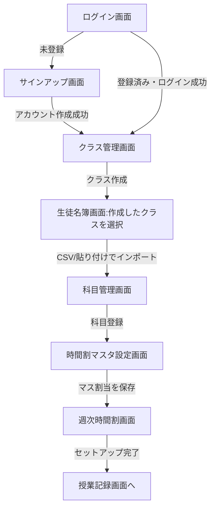
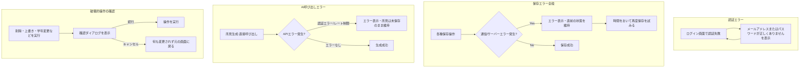

# 画面遷移図:週間時間割・生徒メモ・所見自動生成ツール

`docs/design/screens.md` の画面をもとに、主要なユーザーシナリオごとに画面遷移をMermaid記法で示す。

## 1. 初回セットアップフロー

初めてアカウントを作成し、最初の授業記録ができる状態になるまでの流れ。教員が最初にたどる基本パス。



**補足**: 科目・クラスの登録順は要件上必須ではないが、時間割マスタ設定(F4)は科目が1件以上ないとマスの選択ができない(F3)ため、実務上は 科目登録 → クラス作成 → 生徒登録 → 時間割マスタ設定 の順が推奨される。

## 2. 日常利用フロー(授業記録)

授業の合間・放課後にメモを記録する、最も頻度の高い操作。

```mermaid
flowchart TD
    A[ログイン画面] -->|ログイン成功| B[週次時間割画面]
    B -->|マスを選択| C{科目・クラスが設定されている?}
    C -->|Yes:マス編集モーダル| D["この授業を記録する"を選択]
    C -->|No| E[未設定として表示・記録不可]
    D --> F[授業記録画面:生徒一覧(氏名のみ)]
    F -->|生徒名をタップ| F2[その生徒の行が展開:メモ入力欄+保存ボタン]
    F2 -->|メモ入力| G[その生徒の保存ボタンを実行]
    G -->|保存成功| H[生徒別メモ一覧に反映・一覧に「入力済み」表示]
    G -->|保存失敗| I[その行にエラー表示・入力内容を維持]
    H --> F2b[他の生徒も同様にタップ→入力→個別保存を繰り返す]
    F -->|「戻る」| B
    B -->|曜日の「生活」マスを選択| L[生活記録画面:その日付・クラスの生徒一覧]
    L -->|生徒名をタップ→生活メモ入力→個別保存| H
    L -->|「戻る」| B
```

**補足(生活記録)**: 生活記録画面のクラスは、その日の時間割に登場するクラスが1つなら自動で決まり、2つ以上(教科担任制)または0の場合は画面内で選ぶ(`docs/features/life-shoken/`)。

## 3. 生徒メモの振り返り・編集フロー

学期末の所見作成前などに、特定生徒のメモを確認・整理する流れ。

```mermaid
flowchart TD
    A[生徒名簿画面:生徒の行をクリック] -->|その生徒を選択済みの状態で遷移。「戻る」導線あり| B[生徒別メモ一覧画面]
    C[授業記録画面] -->|生徒名から遷移| B
    N[グローバルナビゲーション] -->|クラス・生徒とも未選択の状態で遷移| B
    B -->|画面内のクラス選択で絞り込み| B2[生徒選択の候補が絞り込まれる]
    B2 -->|生徒を選択| B
    B -->|表示切替| D[日付順 / 教科別]
    B -->|メモを編集| E[保存]
    B -->|メモを削除| F[削除確認 → 一覧から除外]
    B -->|共有区分を切替| G["共有する/共有しない"を更新]
    B -->|「生活メモを追加」:日付を選んで入力| J[生活メモを保存(同じ日付が既にあればエラー)]
    B -->|「戻る」(生徒名簿画面から遷移した場合のみ表示)| A
```

**補足**: グローバルなクラス切替は存在しない。生徒別メモ一覧画面のクラス選択は、この画面内でだけ有効な生徒絞り込み用フィルタである。グローバルナビゲーションから直接開いた場合は「戻る」導線を表示しない(戻り先が定まらないため)。

## 4. 所見生成・保存フロー

学期末に所見文をAI生成(直接呼び出し／プロンプトコピー運用)または手動作成し、保存するまでの流れ。所見はクラス単位の一覧画面(所見管理画面)で、対象期間を1つ指定してクラス全員分をまとめて編集する。

```mermaid
flowchart TD
    A[所見管理画面を開く:クラスと対象期間を指定] --> A2[クラス全員の行が一覧表示される]
    A2 --> A3[特定の生徒の行で「AIで生成する」を開く]
    A3 --> B{APIキー設定済み?}
    B -->|Yes:直接生成| C[目安文字数を指定]
    C --> D[生成ボタンを実行]
    D --> E{対象期間に共有メモがある?}
    E -->|No| F[生成不可のメッセージ表示]
    E -->|Yes| G[AI呼び出し中 ローディング]
    G -->|成功| H[応答テキストをその生徒の所見入力欄に反映]
    G -->|認証/レート制限エラー| I[エラー表示・所見は保存されない]

    B -->|No:プロンプトコピー運用| K[プロンプト表示・コピー]
    K --> L[外部AIチャットに貼り付けて応答を取得]
    L --> M[応答を貼り付け欄に入力し「所見欄に反映」]
    M --> H

    H --> O[所見入力欄で内容を確認・必要に応じて編集]
    O --> P[その行の保存を実行]
    P --> R[その生徒の所見として保存・作成方法を記録]
    R --> T[保存済みバッジ・最終更新日時が行に反映される(同一画面内)]
```

**補足**: 手動作成(F9・F10を経由しない直接入力)も、所見入力欄に直接テキストを入力して保存するだけで同じパスをたどる。上書き確認ダイアログは発生しない(生徒の行にはその生徒の既存所見が初期表示され、保存は常にその所見への意図的な更新になるため)。所見は生徒ごとに1件(学習・生活それぞれ)のみを保持し、対象期間には紐づかないため、期間を変えても内容はそのまま表示される。

## 5. エラー発生時のフロー

代表的なエラーケースをまとめたもの。個別画面のエラー状態は `screens.md` の各画面「状態バリエーション」を参照。



## 未決事項

- パスワードリセットのメール送信後、リンクが無効・期限切れだった場合の再申請フローは `screens.md` の未決事項と同様、要件定義書に明記がないため一般的なフローとして仮定している
